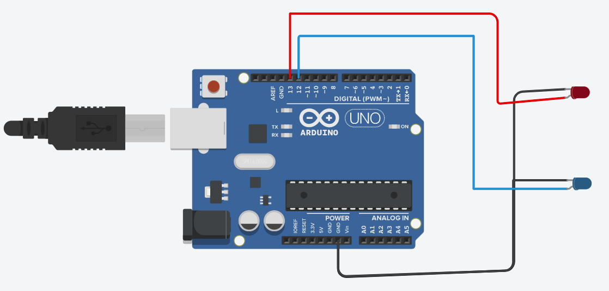

# Demo-1 
- This demo-1 demonstrate sample arduino project that blinks LEDs as 1,2...1,2,3.

# Getting Started
## Requirements
1. Arduino IDE setup. [know more](../../setup/IDE/)
2. Arduino Uno microcontroller board.

## Circuit

## Setup
1. Setup the circuit as above.
2. Open the Arduino IDE and connect Uno to the machine.
3. Create/Modify the [code](./12-123-blinkLED.ino) for Arduino.
4. Verify and dump the code to Arduino. 