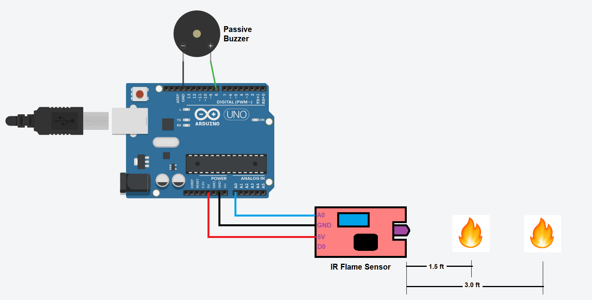

# Sound Sensor - LED
- This demonstration showcases a sample Arduino project designed to trigger alarms when a flame is detected at a certain distance.

# Getting Started
## Requirements
1. Arduino IDE setup. [know more](../../../../setup/IDE/)
2. Arduino Uno microcontroller board.

## Circuit

## Setup
1. Setup the circuit as above.
2. Open the Arduino IDE and connect Uno to the machine.
3. Create/Modify the [code](./flame-demo1.ino) for Arduino.
4. Verify and dump the code to Arduino. 
5. Position a small flame (fire) in front of the flame sensor.
6. If the flame is approximately 1.5 feet from the sensor, it will produce one tone from the buzzer.
7. If the flame is located between 1.5 to 3 feet away, the buzzer will produce a different tone.
8. If the flame is at a distance of 3 feet or more from the sensor, no alarm will be triggered. 
