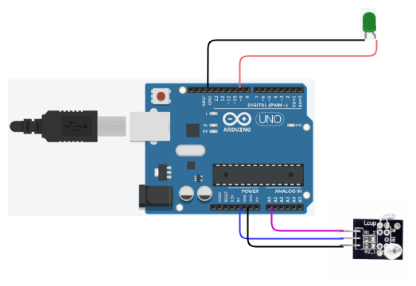

# Heartbeat - LED
- This is a sample arduino project that turn on/off LED based heartbeat.

# Getting Started
## Requirements
1. Arduino IDE setup. [know more](../../../../setup/IDE/)
2. Arduino Uno microcontroller board.

## Circuit

## Setup
1. Setup the circuit as above.
2. Open the Arduino IDE and connect Uno to the machine.
3. Create/Modify the [code](./heartbeat-demo1.ino) in Arduino IDE.
4. Verify and dump the code to Arduino board. 
5. Move heartbeat knob up/down/left/right, LEDs(up/down/left/right) will turn on/off.
6. Push the heartbeat knob button to turn on all LEDs. 