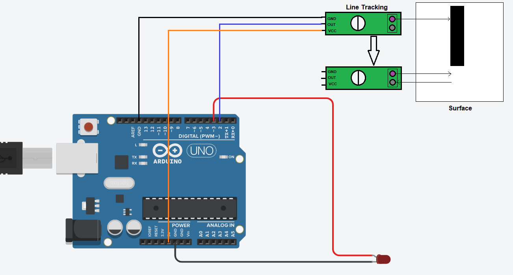

# Line Tracking - LED
- This is a sample arduino project that turn on/off LED based on line tracking sensor on surface.

# Getting Started
## Requirements
1. Arduino IDE setup. [know more](../../../../setup/IDE/)
2. Arduino Uno microcontroller board.

## Circuit

## Setup
1. Setup the circuit as above.
2. Open the Arduino IDE and connect Uno to the machine.
3. Create/Modify the [code](./line-tracking-demo.ino) in Arduino IDE.
4. Verify and dump the code to Arduino board. 
5. LED will be turned on when the sensor is on the black line.
6. Whenever sensor will move from black line to empty surface, LED will be turned off.  