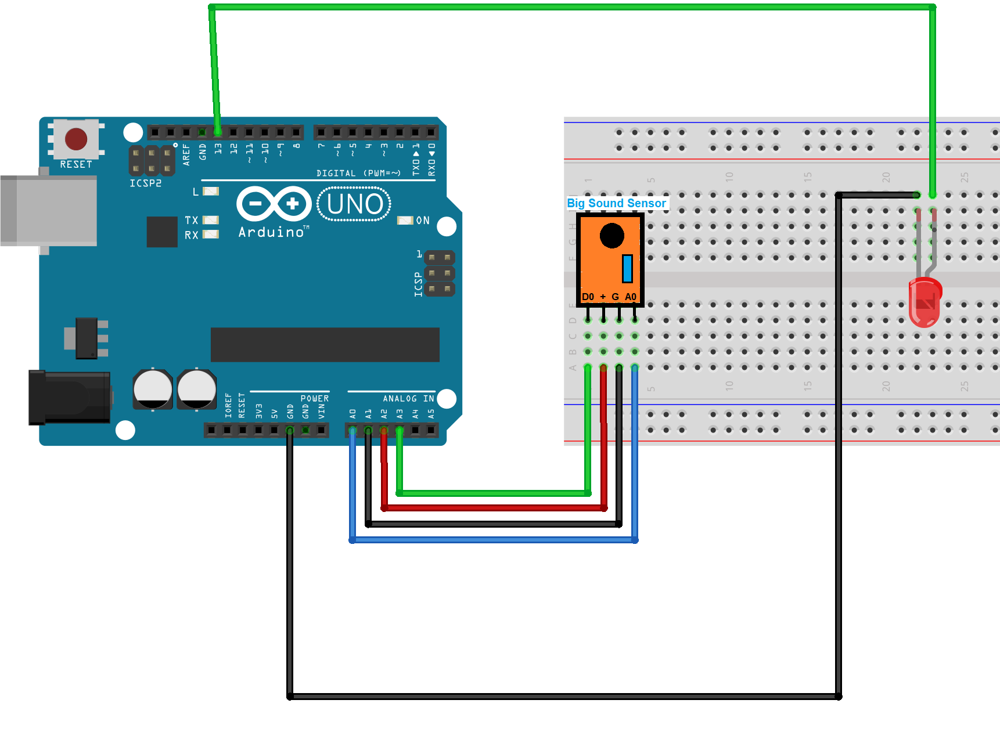

# Sound Sensor - LED
- This demo-2 demonstrate sample arduino project that turn on/off LED as we clap.

# Getting Started
## Requirements
1. Arduino IDE setup. [know more](../../../../setup/IDE/)
2. Arduino Uno microcontroller board.

## Circuit

## Setup
1. Setup the circuit as above.
2. Open the Arduino IDE and connect Uno to the machine.
3. Create/Modify the [code](./clap2on-off.ino) for Arduino.
4. Verify and dump the code to Arduino. 
5. Clap to turn on the LED and clap to turn off LED.